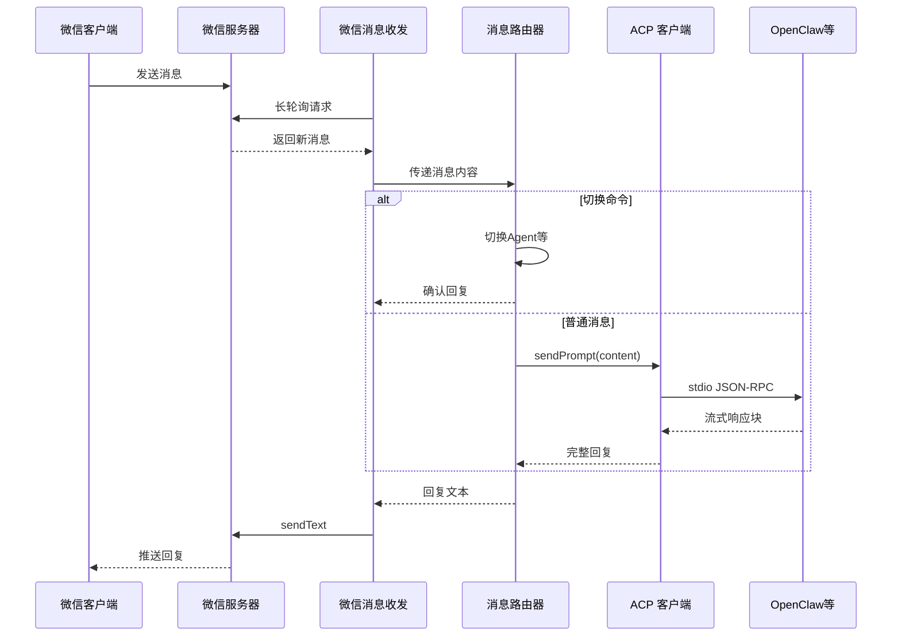

**WeChat ACP Bridge 设计文档**

# 1. 设计思路

## 1.1. 核心问题

现在 Hermes 和 OpenClaw 都原生支持微信了——但你不能在同一个账号上双开。 每个 Gateway 会独占 iLink 连接。

微信用户无法直接与 ACP（Agent Client Protocol）兼容的 AI Agent（OpenClaw、Hermes、OpenCode、Claude Code 等）对话。

## 1.2. 解决方案

构建一个桥接服务，作为微信 iLink Bot API 与 ACP 协议之间的翻译层，将微信消息转发给 Agent，将 Agent 回复发回微信。

## 1.3. 设计原则

- **协议适配，而非耦合**：微信侧和 Agent 侧各自独立封装，桥接层仅做消息路由和格式转换
- **多账号多 Agent**：支持多个微信账号并行运行，每个账号可独立选择后端 Agent
- **热加载**：账号的激活/去激活在运行时实时生效，无需重启服务
- **Session 持久化**：Agent 会话上下文跨消息保持，支持超时自动过期和手动切换
- **可运维**：支持 systemd/launchd 系统服务、前台进程两种运行模式；日志旋转、信号处理

---

# 2. 总体架构

```
┌──────────────────────────────────────────────────────────────────┐
│                        WeChat ACP Bridge                          │
│                                                                   │
│  ┌──────────┐    ┌──────────────┐    ┌──────────────────────┐   │
│  │  WXAPI   │───▶│ MessageRouter │───▶│  AcpBridgeClient     │   │
│  │ (轮询)   │    │ (命令/消息)   │    │  (ACP NDJSON stdio)  │   │
│  └──────────┘    └──────────────┘    └──────────┬───────────┘   │
│        │              │                          │                │
│        │              ▼                          ▼                │
│        │    ┌──────────────────┐    ┌──────────────────────┐    │
│        │    │   Storage 层     │    │   Agent 子进程         │    │
│        │    │ (JSON 文件持久化) │    │  (OpenClaw/Hermes/...) │    │
│        │    └──────────────────┘    └──────────────────────┘    │
│        │                                                        │
│  ┌─────┴──────────────────────────────────────────────────┐     │
│  │              微信 iLink Bot API 服务器                    │     │
│  └────────────────────────────────────────────────────────┘     │
│                                                                   │
│  ┌──────────────────────────────────────────────────────────┐    │
│  │                   CLI 管理接口                              │    │
│  │  login | run | start | stop | status | logs | activate...  │    │
│  └──────────────────────────────────────────────────────────┘    │
└──────────────────────────────────────────────────────────────────┘
```

**三层结构**：

| 层                                         | 职责                                                                  |
| ------------------------------------------ | --------------------------------------------------------------------- |
| **接入层** (`src/weixin/`)                 | 微信 iLink Bot API 客户端：扫码登录、长轮询收消息、发送文本、输入状态 |
| **桥接层** (`src/bridge/`, `src/index.ts`) | 消息路由、Session 管理、多账号轮询编排                                |
| **Agent 层** (`src/acp/`)                  | ACP 协议客户端：spawn Agent 子进程、NDJSON 通信、prompt 转发          |

---

# 3. 逻辑架构

## 3.1. 模块依赖图

```
CLI (commands.ts)
  ├── index.ts (WeChatACPBridge)    ← 主控循环
  │     ├── WXAPI (api.ts)           ← 微信 API
  │     └── MessageRouter (router.ts) ← 消息路由
  │           └── AcpBridgeClient (client.ts)  ← ACP 客户端
  ├── storage/
  │     ├── active-accounts.ts       ← 激活列表
  │     ├── account-state.ts         ← 账号状态
  │     └── session-meta.ts          ← Session 元数据
  ├── config/agents.ts               ← Agent 配置
  ├── util/logger.ts                 ← Winston 日志
  ├── util/settings.ts               ← 全局设置
  └── service/manager.ts             ← 系统服务管理
```

## 3.2. 数据模型

```
AccountState                    SessionMeta
├─ currentAgentKey: string      ├─ sessionKey: string (UUID)
├─ sessions: {                  ├─ accountAlias: string
│    [agentKey]: sessionKey     ├─ userId: string
│  }                            ├─ agentKey: string
└─ lastActive: number           ├─ sessionId: string (ACP)
                                ├─ description: string
                                ├─ createdAt: number
                                └─ lastActive: number
```

## 3.3. 持久化目录结构

```
~/.wechat-acp-bridge/run/
├── bridge.pid                     # 前台进程 PID
├── active_accounts.json           # 当前激活的账号别名列表
├── log_level.json                 # 日志级别持久化
├── logs/
│   └── bridge.log                 # Winston JSON 日志
├── accounts/
│   └── <alias>.json               # 登录凭证（token, baseUrl）
├── account_state/
│   └── <alias>/
│       └── state.json             # 账号当前 Agent 和 session 映射
└── sessions/
    └── <alias>/
        └── <agent>/
            └── <uuid>.json        # Session 元数据
```

---

# 4. 功能结构与说明

## 4.1. CLI 命令

| 命令                                      | 说明                                    |
| ----------------------------------------- | --------------------------------------- |
| `login [alias]`                           | 扫码登录微信，自动激活账号              |
| `run`                                     | 前台运行桥接服务进程                    |
| `start` / `stop` / `restart`              | 后台服务生命周期管理（systemd/launchd） |
| `install` / `uninstall`                   | 安装/卸载系统服务(用户级)               |
| `activate <alias>` / `deactivate <alias>` | 激活/去激活账号（热加载，实时生效）     |
| `list`                                    | 列出所有已保存账号及其状态              |
| `logout <alias>`                          | 删除凭证并去激活                        |
| `status [alias]`                          | 查看账号、Agent、Session 及进程运行状态 |
| `logs [-l level] [-f]`                    | 查看/设置日志级别，实时跟随日志         |

## 4.2. 微信端命令（在聊天中发送）

| 命令              | 说明                                                |
| ----------------- | --------------------------------------------------- |
| `/h`              | 显示帮助信息                                        |
| `/new`            | 创建新会话（重置上下文）                            |
| `/sessions`       | 列出历史会话                                        |
| `/session <id>`   | 切换到指定会话（支持短 ID 前缀匹配）                |
| `/session latest` | 切换到最近活跃的会话                                |
| `/<short>`        | 切换到指定 Agent（如 `/cl`→OpenClaw, `/ha`→Hermes） |

## 4.3. 核心组件

### 4.3.1. WeChatACPBridge (`src/index.ts`)

主控循环，采用 **supervisorLoop 模式**：

1. 每 10 秒从 `active_accounts.json` 读取激活列表
2. 为尚未轮询的激活账号创建 WXAPI 实例并启动 `pollAccount`
3. 每个账号独立 IIFE 长轮询，去激活时自行退出
4. 信号处理（SIGTERM/SIGINT）优雅关闭

### 4.3.2. WXAPI (`src/weixin/api.ts`)

微信 iLink Bot HTTP API 封装：

- **登录**：获取二维码 → 终端展示 → 轮询确认 → 保存凭证
- **长轮询**：POST `/ilink/bot/getupdates`，服务端无新消息时保持连接 35s
- **发送文本**：POST `/ilink/bot/sendmessage`，含消息类型、clientId、内容
- **输入状态**：先 POST `/ilink/bot/getconfig` 获取 typing_ticket（缓存），再 POST `/ilink/bot/sendtyping`

### 4.3.3. MessageRouter (`src/bridge/router.ts`)

消息路由核心：

- **命令解析**：优先级 `/h` > `/sessions` > `/session <key>` > `/new` > `/<short>`
- **Session 生命周期**：
  - 首次消息自动创建 session（首句作为描述）
  - 30 分钟超时自动过期（可配置）
  - 显式 `/new` 强制创建新 session，旧 session 元数据保留
  - `/session <id>` 支持前缀匹配切换
- **Agent 切换**：`/<short>` 切换后端 Agent，同时切换对应 session
- **活性跟踪**：每次消息更新 `lastActive`，用于超时判断和 `/sessions` 排序

### 4.3.4. AcpBridgeClient (`src/acp/client.ts`)

ACP 协议 NDJSON-over-stdio 客户端：

- spawn Agent 子进程，stdin/stdout 通过 ACP NDJSON Stream 连接
- stderr 转发到 Winston 日志
- `initialize` → `newSession` → `sendPrompt` 标准 ACP 流程
- `AcpClientImpl` 实现 ACP Client 接口：
  - `sessionUpdate`: 累积 `agent_message_chunk` 文本块
  - `requestPermission`: 自动授权（优先 `allow_once`）
  - `readTextFile` / `writeTextFile`: 文件操作透传

## 4.4. Agent 配置

`config/agents.yaml` 定义可用后端 Agent：

```yaml
OpenClaw:
  command: 'openclaw'
  args: ['acp']
  short: CL # 微信端快捷命令 /cl
  logo: '🦞' # 微信聊天框Agent消息Logo
```

支持字段：`command`（必需）、`args`、`cwd`、`env`、`short`、`logo`、`description`。

文件缺失时使用内置默认值（OpenClaw + Hermes）。

---

# 5. 消息流程

## 5.1. 普通文本消息

```
微信用户发送 "你好"
  │
  ▼
WXAPI.getUpdates()  长轮询返回消息
  │
  ▼
WeChatACPBridge.pollAccount()
  │  解析消息类型 (message_type === INBOUND_TEXT)
  │  提取 text, userId, contextToken
  │
  ▼
WXAPI.sendTyping(START)  每 5 秒重发 keep-alive
  │
  ▼
MessageRouter.routeMessage(alias, "你好")
  │  非命令文本 → ensureCurrentSession()
  │     ├─ 已有活跃 session (未超时) → 复用
  │     └─ 无活跃 session → createSession()
  │           ├─ new AcpBridgeClient(agentConfig)
  │           ├─ spawn agent 子进程
  │           ├─ ACP initialize + newSession
  │           └─ 持久化 SessionMeta
  │
  ▼
AcpBridgeClient.sendPrompt("你好")
  │  ACP prompt → agent 子进程
  │  agent_message_chunk 累积文本
  │
  ▼
返回 reply 文本
  │
  ▼
WXAPI.sendTyping(STOP)  ← finally 块保证发送
  │
  ▼
WXAPI.sendText(userId, contextToken, reply)  回复发送到微信
```

## 5.2. 命令流程

```
微信用户发送 "/cl"
  │
  ▼
MessageRouter.routeMessage()
  │  resolveModeByCommand("/cl") → "OpenClaw" (agentKey)
  │
  ▼
switchAgent(alias, "OpenClaw")
  │  更新 accountState.currentAgentKey → 持久化
  │  ensureCurrentSession() → 切换到该 Agent 的活跃 session
  │
  ▼
返回 "✅ 已切换当前账号 ... 的后端为 OpenClaw，当前 session: xxx"
```

## 5.3. 多账号并行

```
supervisorLoop (每 10s)
  │
  ├─ 读取 active_accounts.json → ["alias-a", "alias-b"]
  │
  ├─ alias-a 尚未轮询 → new WXAPI("alias-a") → pollAccount(api-a) [IIFE 1]
  │
  └─ alias-b 尚未轮询 → new WXAPI("alias-b") → pollAccount(api-b) [IIFE 2]

IIFE 1 (并行)          IIFE 2 (并行)
  while running:         while running:
    getUpdates()           getUpdates()
    处理消息...            处理消息...
```

账号去激活时，IIFE 检测到 `activeAliases` 中无自身，自动退出并从 `wxapis` Map 移除。

## 5.4. 时序图



---

# 6. 技术栈

## 6.1. 工具列表

| 类别            | 技术                                               | 用途                                                |
| --------------- | -------------------------------------------------- | --------------------------------------------------- |
| **语言**        | TypeScript 6.x                                     | ESNext target, NodeNext module                      |
| **运行时**      | Node.js ≥22                                        | ESM (`"type": "module"`)                            |
| **Agent 协议**  | `@agentclientprotocol/sdk` 0.21                    | NDJSON-over-stdio 子进程通信                        |
| **HTTP 客户端** | axios 1.x                                          | 微信 iLink Bot API 长轮询                           |
| **CLI 框架**    | commander 14.x                                     | 命令行接口                                          |
| **日志**        | winston 3.x                                        | 文件（JSON）+ 终端（彩色）双输出                    |
| **配置**        | yaml 2.x                                           | agents.yaml / settings.yaml 解析                    |
| **校验**        | zod 4.x                                            | 所有外部输入、配置、API 响应的 Schema 校验          |
| **交互**        | inquirer 13.x                                      | CLI 登录确认等交互式提示                            |
| **二维码**      | qrcode-terminal 0.12                               | 终端显示微信扫码登录                                |
| **测试**        | vitest 4.x                                         | 单元测试 + 覆盖率                                   |
| **代码质量**    | ESLint 10, Prettier 3, jscpd, depcheck, commitlint | 代码规范、重复检测、依赖检查、提交规范              |
| **系统服务**    | systemd (Linux) / launchd (macOS)                  | 后台服务管理                                        |
| **版本控制**    | simple-git-hooks                                   | pre-commit 检查（typecheck + lint + format + test） |

## 6.2. 关键技术决策

| 决策                | 选择                        | 理由                                  |
| ------------------- | --------------------------- | ------------------------------------- |
| 模块系统            | ESM (`"type": "module"`)    | 拥抱现代标准，避免 CJS/ESM 混用       |
| Agent 通信          | ACP NDJSON stdio            | 无需端口管理，子进程隔离，标准协议    |
| 长轮询 vs WebSocket | 微信 API 长轮询             | 微信 iLink Bot API 仅支持 HTTP 长轮询 |
| 多账号              | 独立 IIFE 长轮询            | 并行不互相阻塞，去激活后自行退出      |
| Session 存储        | JSON 文件                   | 无外部依赖，支持跨进程读写            |
| 凭证编码            | `encodeURIComponent` 文件名 | 避免特殊字符导致的文件系统问题        |

# 7. 路标

## 7.1. 支持图片、语音、视频、文件。所有媒体（图片/语音/视频/文件）通过 CDN 传输，使用 AES-128-ECB 加密。

原生iLink接口支持，后续版本支持

## 7.2. 支持openclaw-weixin插件

实现类似OpenClaw或Hermes Agent的gateway,支持openclaw-weixin插件，微信消息收发模块与本工具解耦
